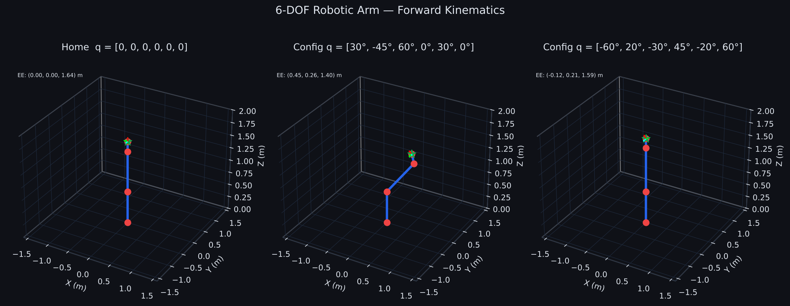
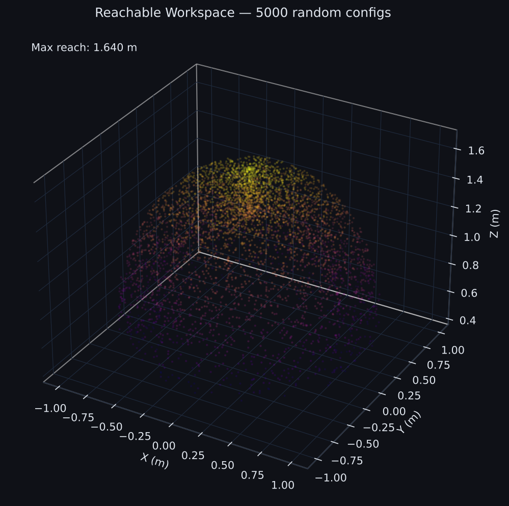
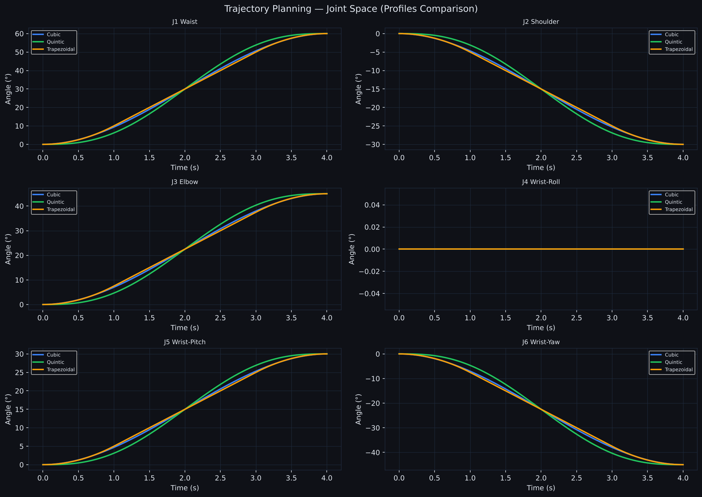
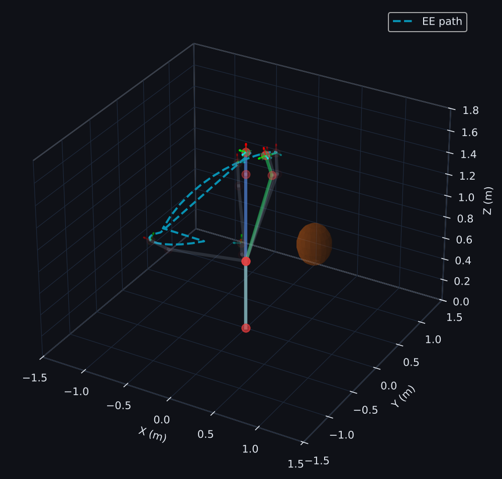
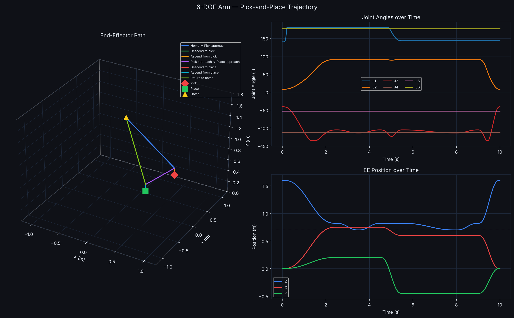

# 6-DOF Robotic Arm Simulation

**IIT Bhilai — Department of Mechanical Engineering**  
**Ashish Devadas | Project Engineer**

A complete Python simulation suite for a 6-degree-of-freedom industrial robotic arm (~300 kg payload class). Implements forward kinematics, inverse kinematics, trajectory planning, and obstacle avoidance — all from first principles using standard robotics conventions.

---

## Features

| Module | What it does |
|--------|-------------|
| `src/dh_kinematics.py` | Forward kinematics (DH), geometric Jacobian, Damped Least-Squares IK with random restarts |
| `src/trajectory.py` | Joint-space cubic/quintic/trapezoidal profiles, Cartesian linear interpolation, multi-segment paths |
| `src/collision.py` | Sphere & box obstacles, capsule arm model, potential field planner |
| `scripts/simulate.py` | Full simulation → 4 publication-quality plots |
| `scripts/pick_and_place.py` | Complete pick-and-place cycle → trajectory plot |

---

## Arm Parameters (Modified Craig DH Convention)

T_i = Rx(α) · Tx(a) · Rz(θ + θ_offset) · Tz(d)

| Joint | Role | a (m) | α (rad) | d (m) | θ_offset |
|-------|------|--------|---------|--------|----------|
| J1 | Waist | 0.000 | 0 | 0.640 | 0 |
| J2 | Shoulder | 0.000 | +π/2 | 0.000 | +π/2 |
| J3 | Elbow (upper arm) | 0.800 | 0 | 0.000 | 0 |
| J4 | Forearm | 0.200 | +π/2 | 0.000 | 0 |
| J5 | Wrist pitch | 0.000 | −π/2 | 0.000 | 0 |
| J6 | Tool flange | 0.000 | 0 | 0.000 | 0 |

Home config (q=0): arm fully upright, EE at **[0, 0, 1.64] m**. Max reach ≈ **1.64 m** from base.

---

## Quick Start

```bash
git clone https://github.com/a8921/6dof-robotic-arm.git
cd 6dof-robotic-arm
pip install -r requirements.txt

# Full simulation (4 plots → media/)
python3 scripts/simulate.py

# Pick-and-place demo
python3 scripts/pick_and_place.py
```

---

## Generated Visualizations

### Forward Kinematics
Three arm configurations shown in 3D with EE frame axes:



### Reachable Workspace
5000 randomly sampled configurations, coloured by end-effector height:



### Trajectory Profiles
Cubic, quintic, and trapezoidal velocity profiles compared across all 6 joints:



### Obstacle Avoidance
Potential field planner navigating around a sphere and box obstacle:



### Pick-and-Place
Complete 8-segment cycle: Home → Pick approach → Pick → Retreat → Place approach → Place → Retreat → Home



---

## Architecture

```
6dof-robotic-arm/
├── src/
│   ├── __init__.py          # Package exports
│   ├── dh_kinematics.py     # FK, IK, Jacobian, workspace
│   ├── trajectory.py        # JointTrajectory, CartesianTrajectory, MultiSegmentPath
│   └── collision.py         # Obstacles, CollisionChecker, PotentialFieldPlanner
├── scripts/
│   ├── simulate.py          # Full demo → media/arm_fk.png, workspace.png, ...
│   └── pick_and_place.py    # Pick-and-place demo → media/pick_and_place.png
├── tests/
│   └── test_kinematics.py   # Unit tests (pytest)
├── media/                   # Generated plots (gitignored, created on run)
├── requirements.txt
└── README.md
```

---

## Algorithms

### Forward Kinematics
Modified DH transform chain (Craig convention):

```
T_i = Rx(α_{i-1}) · Tx(a_{i-1}) · Rz(θ_i) · Tz(d_i)
T_ee = T_1 · T_2 · T_3 · T_4 · T_5 · T_6
```

### Inverse Kinematics
Damped Least Squares (Levenberg–Marquardt style):

```
Δq = Jᵀ (J Jᵀ + λ²I)⁻¹ e
```

where `e = [Δposition; Δorientation]` and `λ = 0.05`. Multiple random restarts (`ik_with_restarts`) improve coverage of the configuration space.

### Trajectory Planning
- **Cubic:** 3rd-order polynomial, zero velocity at endpoints
- **Quintic:** 5th-order polynomial, zero velocity and acceleration at endpoints
- **Trapezoidal:** constant acceleration/deceleration phases, constant velocity cruise

### Potential Field Obstacle Avoidance
```
F_total = F_att + F_rep
F_att   = k_att · (q_goal − q)          # attractive
F_rep   = k_rep · (1/d − 1/d₀) · (1/d²) · ∇d  # repulsive
```

Arm links modelled as capsules (line segment + radius) for collision geometry.

---

## Running Tests

```bash
pip install pytest
pytest tests/ -v
```

---

## Dependencies

| Package | Purpose |
|---------|---------|
| `numpy` | Linear algebra, kinematics |
| `matplotlib` | All visualizations |
| `scipy` | Optional (SVD, numerical utilities) |

---

## License

MIT License — free to use and modify with attribution.

---

*Built as part of the Robotics & Automation project at IIT Bhilai, Department of Mechanical Engineering.*
